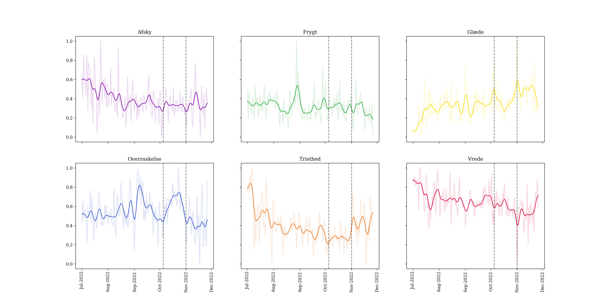

# emotions_dkpol
This repository holds the code for the final project for Cultural Data Science. The aim is to investigate the dynamics on danish twitter before, during and after the election in November 2022. This is done using emotion classification followed summarising the probablitity distributions of the emotions. Finally relative entropy measures, novelty, resonance and transience, are found for the probability distributions. 



## Project Structure
The structure of the project is as follows:

```
├── README.md                                       
├── data     
│   ├── emotions_summarised    
│   ├── idmdl
│   ├── preproccessed   
│   ├── raw
│   └── party_info.json        <- information on each party (Twitter account, hashtag)  
├── fig                   
├── src                        <- main scripts
│   ├── clean_data.py
│   ├── create_party_info.py
│   ├── emotion_classification.py
│   ├── emotion_fluxus.py
│   ├── generate_plots.py
│   ├── scrape_twitter.py
│   └── summarize_emotions.py
├── .gitignore
├── requirements.txt
└── run.sh
```

## Pipeline
To replicate this project run the ```run.sh``` bash script.

| Do | File| Output placement |
|-----------|:------------|:--------|
Scrape tweets | ```src/scrape_tweets.py```| ```data/raw```
Clean tweets | ```src/clean_data.py``` | ```data/preprocessed```
Emotion classification | ```src/emotion_classification.py``` | ```data/preprocessed```
Summarise emotions | ```src/summarize_emotions.py``` | ```data/preprocessed/emotions_summarised```
Get novelty, transience and resonance | ```src/emotion_fluxus.py``` | ```data/preprocessed/idmdl```
Generate plots | ```src/generate_plots.py``` | ```fig```


## Acknowledgements
Thanks to Sara Møller Østergaards emoDynamics project for being the source of inspiration for this project. Thanks to Center for Humanities computing for developing the newsFluxus package.